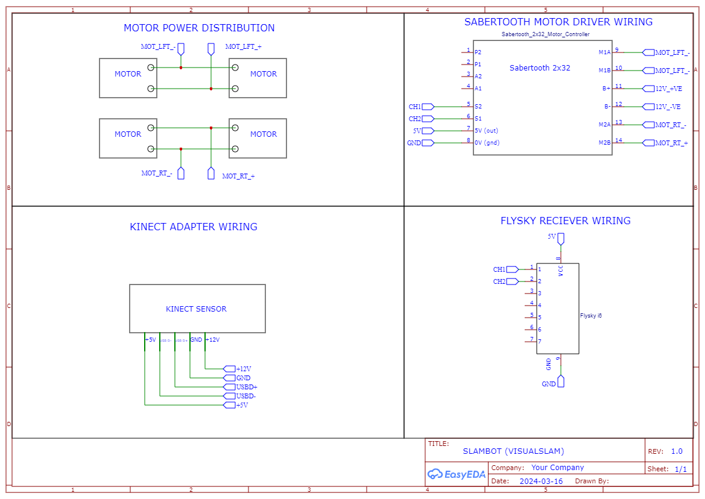

  

<h3 align="center">SLAM with RGB-D Kinect Sensor</h3>

Our SLAM bot is an autonomous mapping robot equipped with a Kinect sensor, capable of generating detailed 3D maps of its surroundings. Using RGB-D data, it employs the Real-Time Appearance-Based Mapping (RTAB) algorithm for efficient mapping and loop closure detection. It navigates indoor and outdoor environments, autonomously capturing and storing point clouds to facilitate digital visualization. Our project aims to enhance autonomy through sensor fusion and algorithm optimization, paving the way for robust mapping in diverse environments.

 
 

<!-- TABLE OF CONTENTS -->

  
Table of Contents

  <ol>
    <li>
      <a href="#about-the-project">About The Project</a>
    </li>
    <li>
      <a href="#built-with">Built With</a></li>
      <ul>
        <li><a href="#Software">Software</a></li>
        <li><a href="#Hardware">Hardware</a></li>
        <li><a href="#Key-Features">Key Features</a>
      </ul>
    </li>
    <li><a href="#Future Development">Future Development</a></li>
    <li><a href="#Use Cases">Use Cases</a></li>
    <li><a href="#Conclusion">Conclusion</a></li>
    <li><a href="#Contact">Contact</a></li>
  </ol>

<!-- ABOUT THE PROJECT -->
## About The Project

The SLAM bot is an autonomous mapping robot designed to create 3D maps of its surroundings using a Kinect sensor. Equipped with both a depth sensor and an RGB camera, mounted atop the robot, the SLAM bot is capable of capturing detailed information about its environment. Operating primarily indoors but with the ability to map anything within its range, the bot aims to autonomously map entire locations, facilitating digital visualization.

Controlled wirelessly via a FLYSKY controller paired with a receiver connected to the robot, the SLAM bot can be directed to move and explore its environment. The wireless controller provides human supervision, but with the integration of appropriate algorithms and sensors, full autonomy is feasible.

The SLAM algorithm used is RTAB (Real-Time Appearance-Based Mapping), which uses RGB-D data for mapping. It employs an incremental appearance-based loop closure detector, using a bag-of-words method to assess the likelihood of new images coming from known locations. When a loop closure is confirmed, it adds constraints to the map's graph, which are then optimized to reduce errors. To maintain real-time performance in extensive environments, a memory management system restricts the number of locations used for loop closure detection and graph optimization.

(<a href="#readme-top">back to top</a>)

### Built With

## Software
* ROS (Robot Operating System)
* RViz for visualization
* RTAB-Map for SLAM functionality
* FreeNect

## Hardware
* Sabertooth Motor Driver
* FLYSKY Receiver and Transmitter
* Xbox 360 Kinect Sensor

(<a href="#readme-top">back to top</a>)

### Key Features
- [ ] Autonomous mapping of 3D environments using Kinect sensor.
- [ ] Wireless control for human supervision, with potential for full autonomy.
- [ ] RTAB SLAM algorithm for real-time mapping and loop closure detection.
- [ ] ROS and RViz integration for software development and visualization.

## Future Development
- [ ] Implementation of algorithms to reduce sensor interference and optimize mapping accuracy.
- [ ] Enhancement of autonomy through sensor fusion and decision-making algorithms.
- [ ] Integration of additional sensors for robust mapping in varied environments. 

<!-- USAGE EXAMPLES -->
## Use Cases 
- [ ] Cave Exploration
- [ ] Defense Purposes
- [ ] Robot Automation

### Media

## Schematic
 

## Product Photos
 

## Conclusion
The SLAM bot project combines hardware and software to create a versatile mapping platform capable of autonomously generating 3D maps of indoor and outdoor environments within range. With a focus on real-time performance and usability, it represents a significant step towards digital representation and exploration of physical spaces.

(<a href="#readme-top">back to top</a>)

<!-- CONTACT -->
## Contact

* Adithya Ajai - [@\_adithya_ajai_](https://www.instagram.com/_adithya_ajai_/) - adithyaajai979@gmail.com
* Akhilesh Donthula - [@akhilehs_](https://www.instagram.com/akhilehs_/) - akh6769@gmail.com
* Siddarth S - [@lionarth_messid](https://www.instagram.com/lionarth_messid/) - siddu16jan@gmail.com
* Jacob Cherian - [@jake.cherian](https://www.instagram.com/jake.cherian/) - jakecherian10@gmail.com

Project Link: [https://github.com/Wh0p3/Robot-mapping](https://github.com/Wh0p3/Robot-mapping)

(<a href="#readme-top">back to top</a>)

